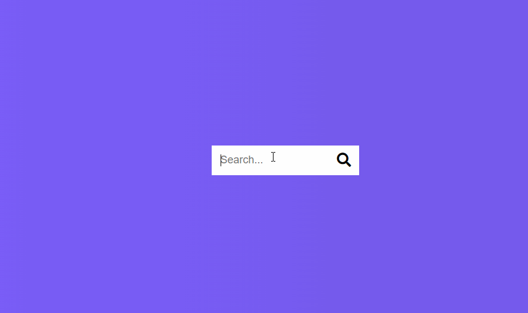

# Hidden Search Widget

## 🦉 Main information

"Hidden search" functionality.

Represents a button with a little search icon from Font Awesome.

When you click it, it fires off a JavaScript event that activates a specific class with added transition for the width of this input to get wider and the button to move over using a transform translate(x). And if you click again its going to shrink back up.

Learning from Brad Traversy & Florin Pop Udemy course